# 设计模式 

设计模式（Design pattern）代表了最佳的实践，通常被有经验的面向对象的软件开发人员所采用。设计模式是软件开发人员在软件开发过程中面临的一般问题的解决方案。这些解决方案是众多软件开发人员经过相当长的一段时间的试验和错误总结出来的。

设计模式是一套被反复使用的、多数人知晓的、经过分类编目的、代码设计经验的总结。使用设计模式是为了重用代码、让代码更容易被他人理解、保证代码可靠性。 毫无疑问，设计模式于己于他人于系统都是多赢的，设计模式使代码编制真正工程化，设计模式是软件工程的基石，如同大厦的一块块砖石一样。项目中合理地运用设计模式可以完美地解决很多问题，每种模式在现实中都有相应的原理来与之对应，每种模式都描述了一个在我们周围不断重复发生的问题，以及该问题的核心解决方案，这也是设计模式能被广泛应用的原因。

`什么是高内聚？模块内部元素具有相同特点的相似程度。提供了更好的程序可靠性，可读性`

`什么是低耦合？指的是模块之间的依赖程度。提供了更好的程序可扩展与可复用性`

[深入理解设计模式（六）：原型模式 - 一指流砂~ - 博客园 (cnblogs.com)](https://www.cnblogs.com/xuwendong/p/9768441.html)

[设计模式 | 菜鸟教程 (runoob.com)](https://www.runoob.com/design-pattern/design-pattern-tutorial.html)

[设计模式目录：22种设计模式 (refactoringguru.cn)](https://refactoringguru.cn/design-patterns/catalog)

## 设计的原则

### 单一职责原则SRP(Single Responsibilities Principle)

**（专人做专事）**

定义：一个类只有一个发生变化原因，应该只有一个引起类受更的原因.。

指出一个类或方法应该只有一个责任，即一个类或方法只负责一项功能，可以通过将每个类或方法的职责限制在一个特定的领域内来实现单一职责原则。

1. 比如：当一个类只有在添加的时候才会触动类的改变，符合单一职责原则。
2. 或者：当一个类中只有一个方法会存在修改的情况从而触动类的改变，且不再在类中新增方法时，也符合单一职责原则。

**好处：**

1. 降低类的复杂性，一个模块只有一个职责，提高系统的可扩展和可维护性。
2. 提高代码的可读性，提高系统的可维护性。
3. 降低变更引起的风险。变更是必然的，如果单一职责做得好，当修改一个功能的时候可以显著的降低对另一个功能的影响。
4. 避免类的膨胀，臃肿。

### 开闭原则OCP（Open Close Principle）

**（热插拔，类似USB）**

定义：**对扩展开放，对修改关闭**。在程序需要进行拓展的时候，不能去修改原有的代码，实现一个热插拔的效果。简言之，是为了使程序的扩展性好，易于维护和升级。想要达到这样的效果，我们需要使用接口和抽象类。不在修改源代码的情况下，完成系统扩展。

​    **好处：**

1. 降低维护成本：开闭原则能够避免在修改现有代码时引入新的问题，从而降低了维护成本。由于新的功能可以通过扩展而不是修改现有代码来实现，所以原有的代码可以保持不变，不会出现错误或者不稳定的情况。
2. 增强扩展性：开闭原则使得新功能可以通过扩展代码而不是修改代码来实现。这样可以减少对现有代码的依赖，增强代码的扩展性。
3. 增强复用性：通过将代码分离成不同的模块，可以提高代码的可复用性。新的功能可以通过组合不同的模块来实现，从而避免了重复编写代码的问题。
4. 提高代码质量：通过遵循开闭原则，可以编写更加稳定、可靠和可读性的代码。这样可以减少代码中的错误和漏洞，提高代码的质量。

总结：

```
面向抽象（接口）编程
通过抽象（接口）封装变化
封装，抽象不是目的，目的是封装变化。
只有把变化封装了，我们的程序，才能做单一、才能做到开闭封闭
```

### **依赖倒转原则DIP（Dependence Inversion Principle）**

**（依赖注入）**

定义：

1. 高层模块不应该依赖低层模块。
2. 抽象不应该依赖细节，细节应该依赖抽象。
3. **【依赖倒转原则】**的本质就是通过抽象（接口或抽象类）使各类或模块的实现彼此独立，互不影响，实现模块间的松耦合。
4. 【依赖倒转原则】是开闭原则的基础，具体内容：针对接口编程，依赖于抽象而不依赖于具体实现。

​    **好处：**

1. 提高系统稳定系统，可维护性。

   解：

   什么是高层模块，什么是低层模块，（高用者）是高层，（被调用者）是低层，这两个模块应该依赖抽象

### **里氏代换原则LSP（Liskov Substitution Principle）**

**（子类可以替换父类）**

定义：里氏代换原则是面向对象设计的基本原则之一。 里氏代换原则中说，任何基类可以出现的地方，子类一定可以出现。LSP 是继承复用的基石，只有当派生类可以替换掉基类，且软件单位的功能不受到影响时，基类才能真正被复用，而派生类也能够在基类的基础上增加新的行为。里氏代换原则是对开闭原则的补充。实现开闭原则的关键步骤就是抽象化，而基类与子类的继承关系就是抽象化的具体实现，所以里氏代换原则是对实现抽象化的具体步骤的规范。

好处：父类可以被子类无缝替换，且原有功能不受任何影响。

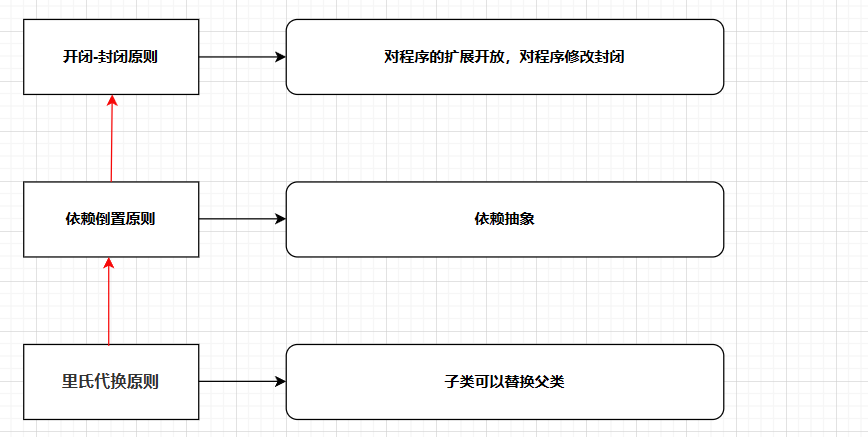

### **接口隔离原则ISP（Interface Segregation Principle）**

**（使用多个隔离的接口，比使用单个接口要好）**

定义：

1. 客户端不应该依赖它不需要接口
2. 一个类对另一个类的依赖应该建立在最小接口上。
3. 接口尽量细分，不要在一个接口放很多方法。

好处：

​     单化接口的职责，从而有效地避免接口污染，较少类之间的依赖关系，可以提高灵活性，不同的小接口可以有多种组合

 总结：

​     `接口隔离原则和单一职责原则的关系。`

​     `单一职责原则：一件事件、影响类变化的原因就只有一个。高内聚 （模块内部元素的相似程度）`

​     `接口隔离原则：低耦合  模块之间的依赖程度低`

​    `一个公司分为好多部门，这种可以解析为接口隔离原则，每个部门之间都是低耦合的。`

​    `财务部只做关于财务部的事，不会做洗厕所工作，给老板按摩工作(秘书)。这个可以解析为单一职责原则。`

`根据接口隔离原则拆分接口时，首先必须满足单一职责原则`

### 迪米特原则，**又称最少知道原则**DP（Demeter Principle）

**（类似代理）**

定义：

1.  一个对象应该对其他对象有最少的了解，使得系统功能模块相对独立。创建类的时候要遵守的法则
2. 如果两个类不必彼此直接通信，那么这两个类就不应当发生直接的相互作用。如果其中的一个类需要调用另一个类的某一个方法的话，可以通过第三者转发这个调用。

好处：

​      降低类之间耦合 

```c#
    只和直接朋友通信
    1、成员对象
    2、方法参数
    3、方法返回值
    4、注：出现在局部变量中的类，不是直接朋友
    
    public class TestA
    {
        public void TestMethod(TestB testB /*直接朋友*/)
        {
            TestC testC = new TestC(); //不是直接朋友
        }

        //直接朋友
        private TestD _testD;

        public TestB /*直接朋友*/ GetTestB()
        {
            return null;
        }

        private List<int> list = new List<int>();
    }

    public class TestB
    { }
    public class TestC
    { }
    public class TestD
    { }
```

### **合成复用原则CRP（Composite Reuse Principle）**

定义：合成复用原则是指：尽量使用合成/聚合的方式，而不是使用继承。

**合成复用原则是将已有的对象纳入到新对象中，作为新对象的对象成员来实现的，新对象可以调用已有对象的功能，从而达到复用**。

继承的问题：

1. 破坏了系统的封装性，基类发生了改变，子类的实现也会发生改变。
2. 子类如果不需要【**某个方法**】则系统耦合性变高。
3. 继承是静态的，不能在程序运行是发生改变。

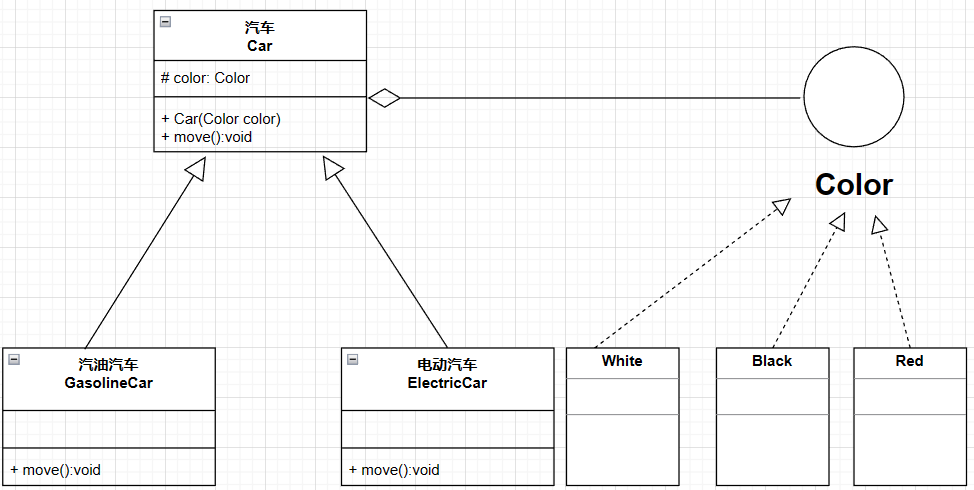

组合、聚合、依赖...….是什么?

他们都是类与类之间的关系:**泛化、实现、组合、聚合、关联、依赖**


​                                                                             类图:

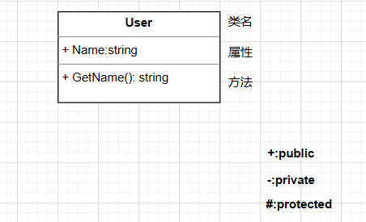


   泛化：其实就是继承

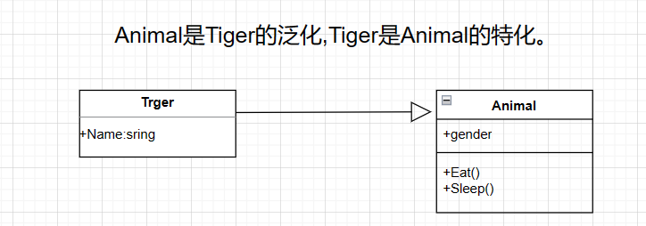

实现：类与接口的关系，表示类实现接口

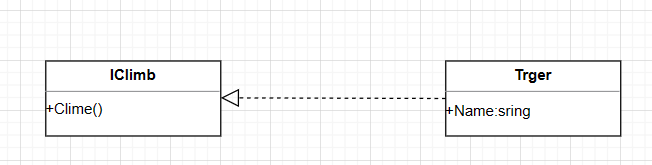

组合：组合是整体和部分的关系，部分没有独立的生命周期，组合是把部分作为整体的对象

组合关系，是强拥有的关系，个体/邵分不存在独立的生命周期，个体/部分的生命周期，与整体的生命周期保持一致。

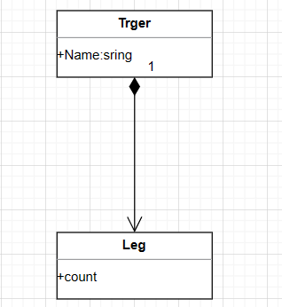


聚合：聚合也是整体与部分的关系，但是个体有独立的生命周期，聚合是把个体对象的指针（引用）作为整体类的属性（弱拥有）

一个对象*包含*指向另一个对象的引用， 并将部分工作委派给引用对象

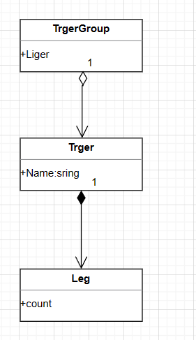

关联：关联是一种拥有关系，它使一个类知道另一个类的属性和方法（知道关系）

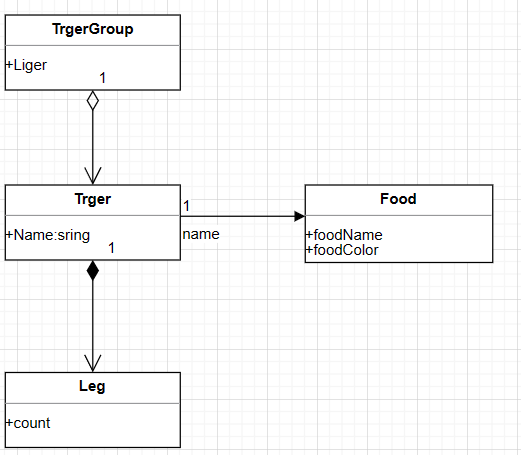

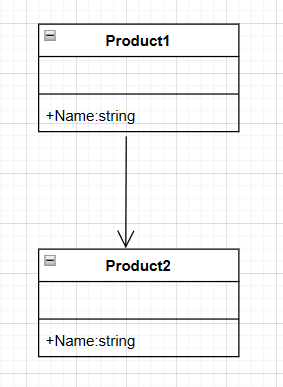

依赖：依赖是一种使用关系

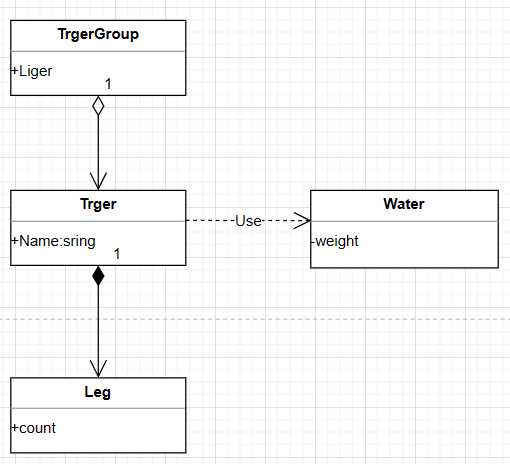


####                                                                 **设计原则总结**

1. 设计原则是「高内聚、低耦合」的具体落地。
2. 单一职责原则要求在软件系统开发、设计中，一个类只负责一个功能领域的相关职责。
3. 开放封闭原则要求一个软件应该对扩展开放，对修改封闭，即在不修改源代码的情况下，完成系统功能的扩展。
4. 里式替换原则决定了子类可以赋值给父类。
5. 依赖倒置原则要求抽象不应该依赖于细节，细节应该依赖于抽象。要面向接口编程，不要面向实现编程。
6. 迪米特原则要求一个对象尽可能少的与其他对象发生相互作用。
7. 接口隔离原则要求客户端不应该依赖那些他不需要的接口，即将一些大的接口细化成一些小的接口供客户端使用。
8. 合成复用原则要求我们尽量使用对象的组合，而非继承来达到复用的目标。


## UML图

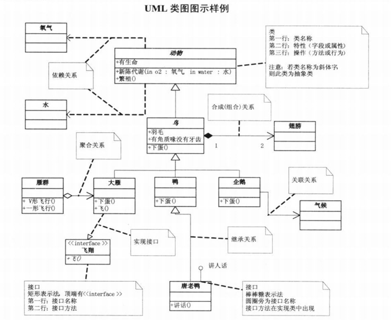


[面向对象的照妖镜——UML类图绘制指南 - 姜承轩 - 博客园 (cnblogs.com)](https://www.cnblogs.com/green-jcx/p/16769300.html)

[UML 类图教程 - 知乎 (zhihu.com)](https://zhuanlan.zhihu.com/p/456759825)

[30分钟学会UML类图 - 知乎 (zhihu.com)](https://zhuanlan.zhihu.com/p/109655171)

## 设计模式的类型

 **创建型模式**

   作用于对象的创建，将对象的创建与使用分离

- 单例模式（Singleton Pattern）
- 简单工厂模式（Factory Pattern）
- 工厂方法模式（Factory Method）
- 抽象工厂模式（Abstract Factory Pattern）
- 建造者模式（Builder Pattern）
- 原型模式（Prototype Pattern）

**结构型模式**

   作用于对象和类组装成较大的结构， 并同时保持结构的灵活和高效。“组合优于继承”。

- 适配器模式（Adapter Pattern）
- 桥接模式（Bridge Pattern）
- 组合模式（Composite Pattern）
- 装饰器模式（Decorator Pattern）
- 外观模式（Facade Pattern）
- 享元模式（Flyweight Pattern）
- 代理模式（Proxy Pattern）

**行为型模式**

​    作用于类或者对象之间互相协作完成单个对象无法单独完成的任务,以及怎样分配职责。

- 责任链模式（Chain of Responsibility Pattern）

- 命令模式（Command Pattern）

- 解释器模式（Interpreter Pattern）

- 迭代器模式（Iterator Pattern）

- 中介者模式（Mediator Pattern）

- 备忘录模式（Memento Pattern）

- 观察者模式（Observer Pattern）

- 状态模式（State Pattern）

- 空对象模式（Null Object Pattern）

- 策略模式（Strategy Pattern）

- 模板模式（Template Pattern）

- 访问者模式（Visitor Pattern）

  

  

  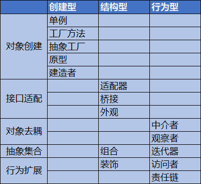

  

  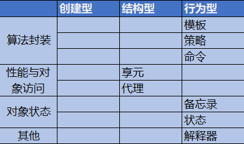

  

##  创建型模式

**用于对象的创建，将对象的创建与使用分离**

### 单例模式（Singleton Pattern）

单例模式（Singleton Pattern）是 所以有语言 中最简单的设计模式之一。这种类型的设计模式属于创建型模式，它提供了一种创建对象的最佳方式。

这种模式涉及到一个单一的类，该类负责创建自己的对象，同时确保只有单个对象被创建。这个类提供了一种访问其唯一的对象的方式，可以直接访问，不需要实例化该类的对象。

注：

1、单例类只能有一个实例。

2、单例类必须自己创建自己的唯一实例。

3、单例类必须给所有其他对象提供这一实例。

**介绍**

**意图：**单例模式能保证一个类只有一个实例，并提供一个访问该实例的全局点。（违法单一职责，解决两个问题）

**主要解决：**一个全局使用的类频繁地创建与销毁。

**何时使用：**当您想控制实例数目，节省系统资源的时候。

**关键代码：**

1、构造函数是私有的

2、创建一个唯一的对象

单例模式几种介绍：

1、饿汉式

  描述： 这种对象还没有被调用就在内存中，造成资源浪费。

  优点：没有加锁，执行效率会提高。

   缺点：浪费内存。

2、懒汉式，线程不安全

  描述：当你需要对象的时候，我再给你创建对象，不会造成内存浪费。

  优点：需要的时候创建，不会造成内存浪费。

  缺点：线程不安全。

  实例


```c#
 public class LazyManSigle
    {
        private static LazyManSigle _lazyManSigle;
        private LazyManSigle()
        {
        }   
     
        public static LazyManSigle GetInstance()
        {
        //没有创建，就创建，假如创建了，就返回
        if (_lazyManSigle == null)
        {
            _lazyManSigle = new LazyManSigle();
        }
        return _lazyManSigle;
    }
}
```
3、懒汉式，线程安全（双重检查，加锁）

  描述：当你需要对象的时候，我再给你创建对象，不会造成内存浪费，双if加锁检查使用对象线程安程，多线程下也只有创建一个实例。

  优点：需要的时候创建，不会造成内存浪费，并线程安全。

  缺点：线程安全，加锁会影响效率。

   但是在反射下可以被破坏的。

  实例


```c#
 public class LazyManSigle
{
    private static LazyManSigle _lazyManSigle;
    private static object _lock = new object();
    private LazyManSigle()
    {
    }
   public static LazyManSigle GetInstance()
    {
        //没有创建，就创建，假如创建了，就返回
        //先判断 if 加锁 然后判断，可以提升一点性能，不是一直锁等待
        if (_lazyManSigle == null)
        {
            //加锁
            lock (_lock)
            {

                if (_lazyManSigle == null)
                {
                    _lazyManSigle = new LazyManSigle();
                    Console.WriteLine("我被创建了");
                }

            }

        }
        return _lazyManSigle;
    }
}
```
4、静态内部类

  描述：当你需要对象的时候，我再给你创建对象，也线程安全的。

  优点：需要的时候创建，不会造成内存浪费，并线程安全，不用自己加锁。

  实例  

```c#
    public class InnerSignleton
    {
        private static class InnerClassHolder
        {
            public static InnerSignleton _singleton = new InnerSignleton();
        }
        private InnerSignleton()
        {
           
        }
        public static InnerSignleton GetInstance()
        {
            return InnerClassHolder._singleton;
        }

    }
```

5、可以使用c#Lazy类

[C# 使用Lazy 懒加载 - WmW - 博客园 (cnblogs.com)](https://www.cnblogs.com/luludongxu/p/15244159.html)

### 简单工厂模式（Factory Pattern）

1. 简单工厂模式，又叫静态工厂方法（Static Factory Method）,它不属于23种设计模式之一。

2. 简单工厂模式，是由工厂决定创建出哪一种产品类的实例，是工厂模式家族中最简单的模式.。

   优点：

   1. 简单工厂设计模式解决了客户端直接依赖于具体对象的问题。客户端消除了创建对象的责任，仅仅承担使用的责任。简单工厂模式实现了对责任的分割。

   2. 简单工厂也起到了代码复用的作用。

      

   缺点：

   1. 系统扩展困难，一旦加入新功能，就必须要修改工厂逻辑。
   2. 简单工厂集合了所有创建对象的逻辑，一旦不能正常工作，会导致整个系统出现问题。
   
   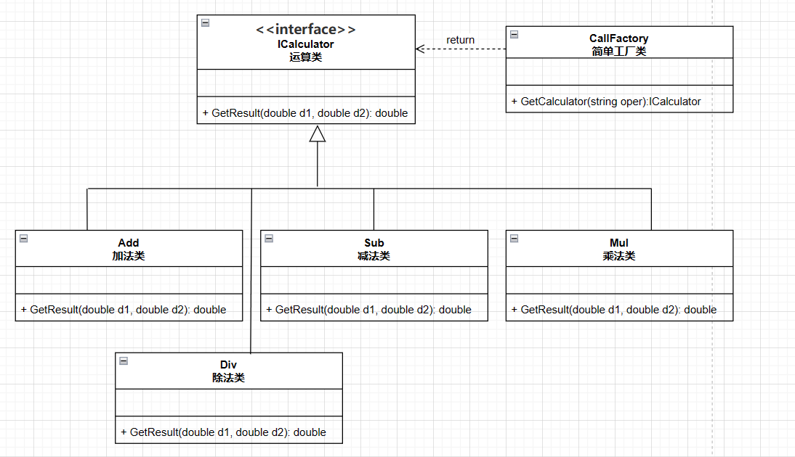

 违反开闭原则所以， 就要使用工厂方法 。

### 工厂方法模式（Factory Method）

定义：一个用于创建对象接口，让子类决定实体化哪一个类，工厂方法使用一个的实例化，延迟到子类。

细节依赖抽象

给每个子类对象 创建一个工厂

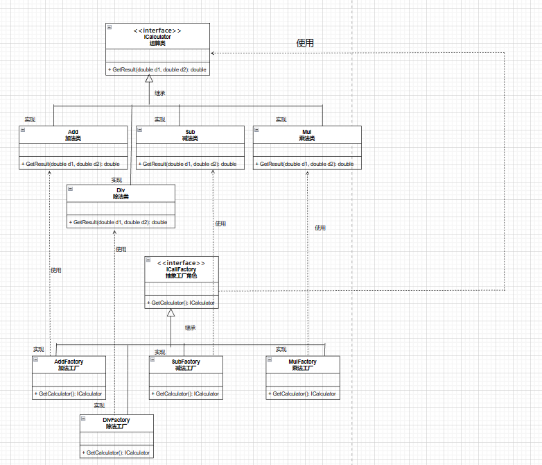

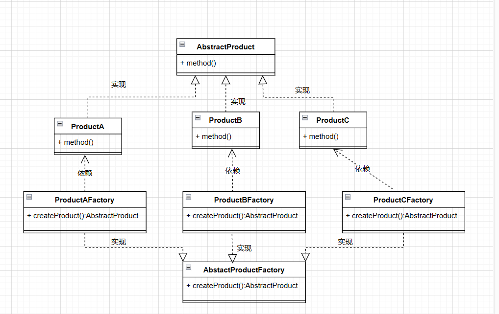


`抽象工厂角色:这是工厂方法模式的核心，是具体的工厂角色必须实现的接口或者必须继承的抽象类。`

`具体工厂角色:它包含和具体业务逻辑有关的代码。由应用程序调用以创建对应的具体产品对象。` 

`抽象产品角色:它是具体产品继承的父类或者接口。`

 `具体产品角色类:具体工厂角色创建的对象，就是该类的实例。`

**优点：**

1. 一个调用者想创建一个对象，只要知道其名称就可以了。

2. 扩展性高，如果想增加一个产品，只要扩展一个工厂类就可以。 

3. 屏蔽产品的具体实现，调用者只关心产品的接口。

4. 用户只关系产品类工厂就可以了，无须关心创建细节。

   新加入产品类时，无须修改抽象工厂和抽象产品提供的接口，无须修改客户端，也无须修改其他的具体工厂和具体产品，而只要添加一个具体工厂和具体产品就可以了

**缺点：**

​     每次增加一个产品时，都需要增加一个具体类和对象实现工厂，使得系统中类的个数成倍增加，在一定程度上增加了系统的复杂度，同时也增加了系统具体类的依赖。这并不是什么好事。

工厂方法模式和简单工厂模式的区别

**简单工厂模式（静态工厂）：**

（1）工厂类负责创建的对象比较少，由于创建的对象较少，不会造成工厂方法中的业务逻辑太过复杂。

（2）客户端只知道传入工厂类的参数，对于如何创建对象并不关心。

 （3）当须加入新产品时， 就要修改 产品工厂类，无法做到 开闭原则

**工厂方法模式：**

（1）客户端不知道它所需要的对象的类。

（2）抽象工厂类通过其子类来指定创建哪个对象。

### 抽象工厂模式（Abstract Factory Pattern）

定义：为了缩减创建子类工厂的数量，不必给每一个产品分配一个工厂类，可以将产品进行分组，每组中的不同产品由同一个工厂类的不同方法来创建。

核心：同一产品生产同一类型产品

**优点：**

当一个产品族中的多个对象被设计成一起工作时，它能保证客户端始终只使用同一个产品族中的对象。

**缺点：**

1. 产品族扩展非常困难，要增加一个系列的某一产品，既要在抽象的 Creator 里加代码，又要在具体的里面加代码。
2.  由于采用该模式需要向应用中引入众多接口和类， 代码可能会比之前更加复杂。

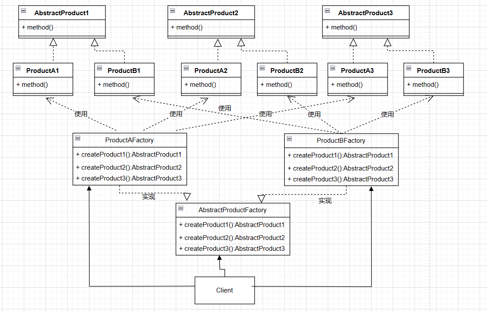

​                                        **每个具体工厂类都对应一个特定的产品变体。**

 跟工厂族有点像？

`抽象工厂角色:这是抽象工厂模式的核心，是具体的工厂角色必须实现的接口或者必须继承的抽象类。(分组)`

`具体工厂角色，它包含和具体业务逻辑有关的代码。由应用程序调用以创建对应的具体产品对象。`

`抽象产品角色:它是具体产品继承的父类或者接口。`

`具体产品角色类:具体工厂角色创建的对象，就是该类的实例。`


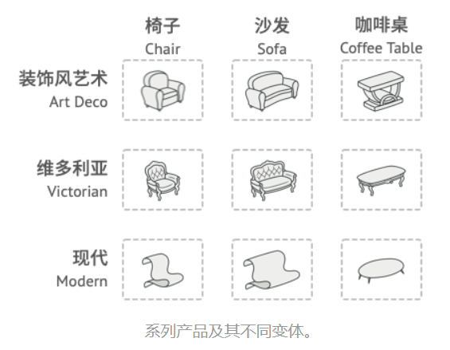

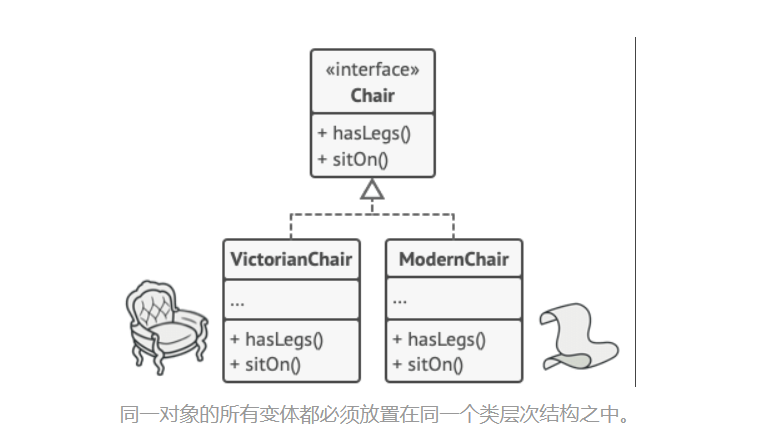

**抽象工厂模式和工厂方法模式对比**

**抽象工厂模式的定义：**为创建一组相关或相互依赖的对象提供一个接口，而且无需指定它们的具体类。
**工厂方法模式的定义：**为某个对象提供一个接口，而且无需指定它们的具体类。
都是子类实现接口的方法，并在子类写具体的代码。

工厂方法模式中也是可以有多个具体工厂，也是可以有多个抽象产品，和多个具体工厂、具体产品类。

区别是在抽象工厂接口类中，能创建几个产品对象。 

抽象工厂模式的工厂能创建多个相关的产品对象，而工厂方法模式的工厂只创建一个产品对象。

#### 工厂模式总结

简单工厂︰一个工厂类，一个产品抽象类，工厂类创建方法依据传入参数并判断，选择创建具体产品对象。

```c#
public class ProductFactory
{
    
    public static IProduct Create (sting x)
    {
         switch(x)
         {
              case "Product1":   
               return IProduct =new () Product1 ;
                 case "Product1":
               return IProduct  = new () Product2;
         }
    }
}

ProductFactory.Create("xx1"); 
```

工厂方法︰多个工厂类，一个产品抽象类，利用多态创建不同的产品对象，避免了大量的switch-case判断。

解决工厂的switch

```c#
public interface IProduct {
    
    void  Create();
}

public class Product:IProduct
{
    
    public void Create()
    {
       
    }
}

public interface IProductFactory
{
    
    IProduct GetIProduct();
}

public class ProductFactory:IProductFactory
{
    
    public IProduct GetIProduct()
    {
        return new Product();
    }
}


IProductFactory productFactory= new ProductFactory();
IProduct product = productFactory.GetIProduct();
product.Create();
```

抽象工厂︰多个工厂类，多个产品抽象类，产品子类分组，同一个工厂实现类创建同组中的不同产品，减少了工厂子类的数量。

```c#
public interface IAbastractProduct1
{
    void ShowAbastractProduct1();
}

public interface IAbastractProduct2
{
    void ShowAbastractProduct2();
}


public class  AbastractProduct1:IAbastractProduct1
{
    public void ShowAbastractProduct1()
    {
        
        
    }
}


public class  AbastractProduct2:IAbastractProduct2
{
    public void ShowAbastractProduct2()
    {
        
        
    }
}

public interface IAbastractProductFactory
{
    IAbastractProduct1 GetAbastractProduct1();
    IAbastractProduct2 GetAbastractProduct2();
}

public class ProductFactory:IAbastractProductFactory
{
    
   public IAbastractProduct1 GetAbastractProduct1()
   {
       return new AbastractProduct1();
   }
   public IAbastractProduct2 GetAbastractProduct2()
    {
        return new AbastractProduct2();
    }
}

IAbastractProductFactory factory = new ProductFactory();
factory.GetAbastractProduct1().ShowAbastractProduct1();
factory.GetAbastractProduct2().ShowAbastractProduct2();
```

``工厂方法模式与抽象工厂模式都属于创建型模式，在工厂方法模式中弥补了简单工厂模式的缺陷（不符合开闭原则），而在抽象工厂模式中弥补了工厂方法模式的不足（一个工厂只能生产一种产品）。`

### 建造者模式（Builder Pattern）

又称生成器模式

定义：

在软件系统中，有时候面临着"一个复杂对象"的创建工作，其通常由各个部分的子对象用一定的算法构成；由于需求的变化，这个复杂对象的各个部分经常面临着剧烈的变化，但是将它们组合在一起的算法却相对稳定。

是将一个复杂对象的构建和它的表示分离，使用同样的构建过程，可以创建不同的表示。

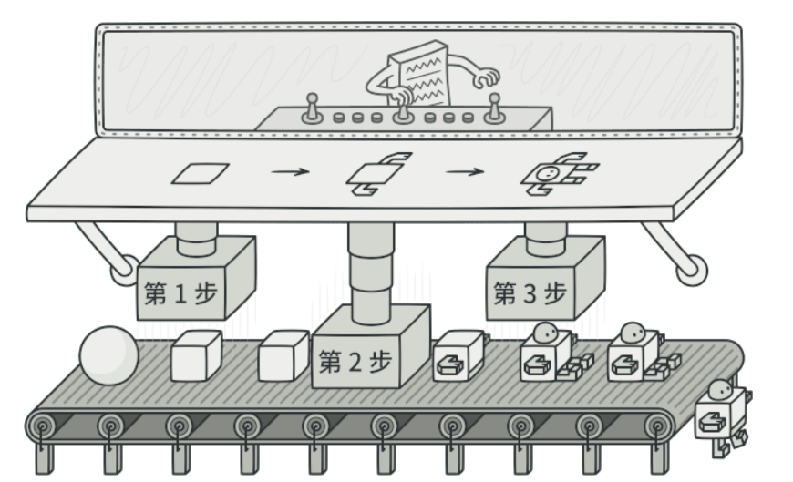

**注意事项：**与工厂模式的区别是：建造者模式更加关注与零件装配的顺序。

建造者模式结构：

1. AbstractBuilder/Builder((抽象建造者/生成器)
   为创建一个产品对象的各个部件指定抽象接口，在该接口或者抽象类中，一般提供两种方法，第一种就是各个组件的创建方法，
   另一类方法是对象返回方法，用于将构建完成的对象返回。

2. ConcreteBuilder(具体建造者/具体生成器)
   具体建造者实现或者继承抽象建造者,实现各个组件的创建方法和对象方法的方法。

3. Product(产品)
   被构建的复杂对象，包含多个组件。

4. Director(指挥者/主管)
   指挥者负责安排复杂对象的建造顺序。

   这个类的职责就是监工

5.  Client(客户端)

    必须将某个建造者对象与主管类关联。 一般情况下， 你只需通过主管类构造函数的参数进行一次性关联即可。 此后主管类就能使用建造者对象完成后续所有的构造任务。 但在客户端将建造者对象传递给主管类制造方法时还有另一种方式。 在这种情况下， 你在使用主管类生产产品时每次都可以使用不同的建造者。

   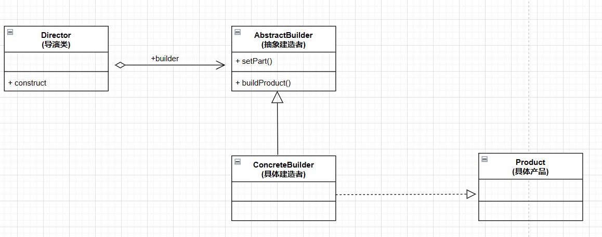

   

   

   [设计模式之建造者(Builder)模式 | 菜鸟教程 (runoob.com)](https://www.runoob.com/w3cnote/builder-pattern.html)

   [设计模式：Builder模式 | 菜鸟教程 (runoob.com)](https://www.runoob.com/w3cnote/builder-pattern-2.html)

### 原型模式（Prototype Pattern）

定义：是用于创建重复的对象，同时又能保证性能。


## 结构型模式

   **作用于对象和类组装成较大的结构， 并同时保持结构的灵活和高效。“组合优于继承”。**

### 适配器模式（Adapter Pattern）

**亦称：** 封装器模式、Wrapper、Adapter

**意图：**

1. 将一个类的接口转换成客户希望的另外一个接口。适配器模式使得原本由于接口不兼容而不能一起工作的那些类可以一起工作。
2. 它能使接口不兼容的对象能够相互合作。

应用场景：

在软件系统中，我们经常会需要将一些现成的对象放到新的环境中进行使用，但是新的环境要求的接口，是这些现存对象所不能满足的。如何能利用现有的对象，又能满足新的引用环境所需要的接口?

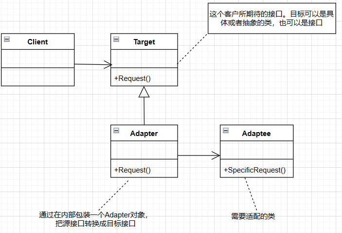

1.Adaptee:初始角色，实现了我们想要的功能，但是接口不匹配

2.Target:目标角色，定义了用户希望的接口。

3.Adapter:适配器角色，实现了目标接口。实现的方法是，内部包含一个Adaptee对象，通过调用Adaptee对象原有的方法实现功能。

优点：

- *单一职责原则*你可以将接口或数据转换代码从程序主要业务逻辑中分离。
-  *开闭原则*。 只要客户端代码通过客户端接口与适配器进行交互， 你就能在不修改现有客户端代码的情况下在程序中添加新类型的适配器。
- 更好的复用性，如果功能已存在，只是接口不兼容，就可以通过适配器模式就可以让这些功能得到 更好的复用。

缺点：

-  代码整体复杂度增加， 因为你需要新增一系列接口和类。 有时直接更改服务类使其与其他代码兼容会更简单。

  

### 装饰器模式（Decorator Pattern）

**亦称：** 装饰者模式、装饰器模式（包装模式）、Wrapper、Decorator

意图：

动态的给一个对象添加一些额外的职责，就增加功能来说，装饰模式比生成子类更为灵活。

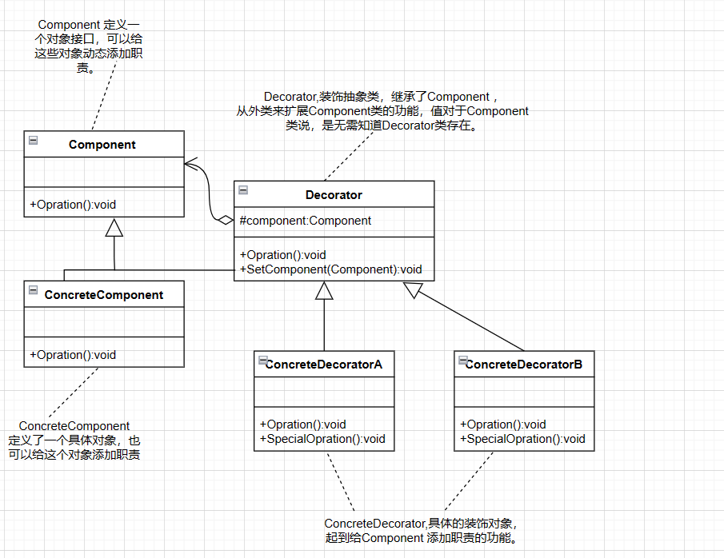


1. **部件** （Component） 声明封装器和被封装对象的公用接口。
2. **具体部件** （Concrete Component） 类是被封装对象所属的类。 它定义了基础行为， 但装饰类可以改变这些行为。
3. **基础装饰** （Decorator） 类拥有一个指向被封装对象的引用成员变量。 该变量的类型应当被声明为通用部件接口， 这样它就可以引用具体的部件和装饰。 装饰基类会将所有操作委派给被封装的对象。
4. **具体装饰类** （Concrete Decorators） 定义了可动态添加到部件的额外行为。 具体装饰类会重写装饰基类的方法， 并在调用父类方法之前或之后进行额外的行为。
5. **客户端** （Client） 可以使用多层装饰来封装部件， 只要它能使用通用接口与所有对象互动即可。

 主要解决：

1. 子类继承爆炸的问题。
2. 多原化自由组合的需求。
3. 父类不会发现变化。
4. 装饰器模式有效的把类的核心职责和装饰功能分来解耦了。

**优点：**装饰类和被装饰类可以独立发展，不会相互耦合，装饰模式是继承的一个替代模式，装饰模式可以动态扩展一个实现类的功能。

**缺点：**多层装饰比较复杂。

**使用场景：** 

1. **如果你希望在无需修改代码的情况下即可使用对象， 且希望在运行时为对象新增额外的行为， 可以使用装饰模式。**

2.  装饰能将业务逻辑组织为层次结构， 你可为各层创建一个装饰， 在运行时将各种不同逻辑组合成对象。 由于这些对象都遵循通用接口， 客户端代码能以相同的方式使用这些对象。

3.  **如果用继承来扩展对象行为的方案难以实现或者根本不可行，你可以使用该模式。**

4. 需要增加由一些基本功能的排列组合而产生的非常大量的功能

   
   
   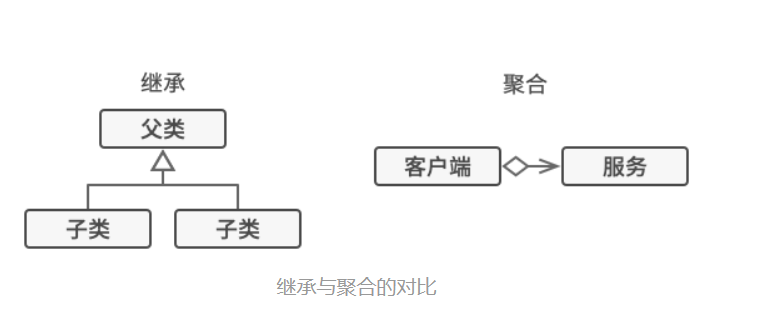
   
   一个对象可以使用多个类的行为， 包含多个指向其他对象的引用， 并将各种工作委派给引用对象。 聚合 （或组合） 组合是许多设计模式背后的关键原则 （包括装饰在内）

总结：

装饰者模式本质上来说是AOP思想的一种实现方式，其持有被装饰者，因此可以控制被装饰者的行为从而达到了AOP的效果。


### 代理模式（Proxy Pattern）

**意图：**为其他对象提供一种代理，以控制对这个对象的访问。

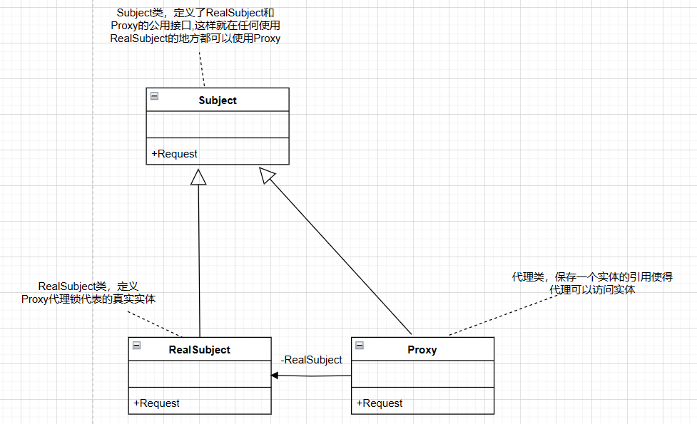

(1) **Subject（抽象主题角色）**：它声明了真实主题和代理主题的共同接口，这样一来在任何使用真实主题的地方都可以使用代理主题，客户端通常需要针对抽象主题角色进行编程。

 (2) **Proxy（代理主题角色）**：它包含了对真实主题的引用，从而可以在任何时候操作真实主题对象；在代理主题角色中提供一个与真实主题角色相同的接口，以便在任何时候都可以替代真实主题；代理主题角色还可以控制对真实主题的使用，负责在需要的时候创建和删除真实主题对象，并对真实主题对象的使用加以约束。通常，在代理主题角色中，客户端在调用所引用的真实主题操作之前或之后还需要执行其他操作，而不仅仅是单纯调用真实主题对象中的操作。

 (3) **RealSubject（真实主题角色）**：它定义了代理角色所代表的真实对象，在真实主题角色中实现了真实的业务操作，客户端可以通过代理主题角色间接调用真实主题角色中定义的操作。

代理模式的应用场景

> ​    **(1) 当客户端对象需要访问远程主机中的对象时可以使用远程代理。**
>
> ​    **(2) 当需要用一个消耗资源较少的对象来代表一个消耗资源较多的对象，从而降低系统开销、缩短运行时间时可以使用虚拟代理，例如一个对象需要很长时间才能完成加载时。**
>
> ​    **(3) 当需要为某一个被频繁访问的操作结果提供一个临时存储空间，以供多个客户端共享访问这些结果时可以使用缓冲代理。通过使用缓冲代理，系统无须在客户端每一次访问时都重新执行操作，只需直接从临时缓冲区获取操作结果即可。**
>
> ​    **(4) 当需要控制对一个对象的访问，为不同用户提供不同级别的访问权限时可以使用保护代理。**
>
> ​    **(5) 当需要为一个对象的访问（引用）提供一些额外的操作时可以使用智能引用代理。**

**代理的分类**
`1、远程代理:为一个对象在不同的地址空间，提供局部代表，这样可以隐藏一个对象存在于不同地址空间的事实。`
`客户端调用Web服务，会生成WebReference文件和文件夹，WebReference就是代理，使得客户端可以实现远程访问等功能。`
`2、虚拟代理，如果要创建开销很大的对象，可以通过代理来存放实例化需要很长时间的真实对象。`
`打开一个很大的网页，除了文字先出现外，图片和视频等都是慢慢出现的。`
`查询某个部门下所有的员工的信息，姓名、性别、年龄、毕业院校、部门、照片、slogen......`
`3、安全代理，用来控制真实对象的访问权限。`
`订单系统，要求是:一旦订单被创建，只有订单的创建人才可以修改订单中的数据，其他人则不能修改`


**优点：** 

1、职责清晰。

 2、高扩展性。

 3、智能化。

**缺点：** 

1、由于在客户端和真实主题之间增加了代理对象，因此有些类型的代理模式可能会造成请求的处理速度变慢。 

2、实现代理模式需要额外的工作，有些代理模式的实现非常复杂。


### 外观模式（Facade Pattern）

**意图：**

隐藏系统的复杂性，并向客户端提供了一个客户端可以访问系统的接口,这个统一接口组合了子系统的多个接口。使用子系统更容易被访问和使用。

 适配器模式与外观模式关系

**【外观模式】**为现有对象定义了一个新接口， **【适配器模式】**则会试图运用已有的接口。 *适配器*通常只封装一个对象， *外观*通常会作用于整个对象子系统上。

**优点：** 

1. 隐藏系统的复杂性，让客户端使用系统功能时变得简单

2. 实现客户端和子系统时间的解耦。 

   

**缺点：**

1. 不符合开闭原则，如果客户端需要使用更多功能，不仅仅需要修改子系统，也必须修改外观层。


### 桥接模式（Bridge Pattern）

意图：

将抽象部分与它的实现部分分离，使用他们都可以独立的变化。

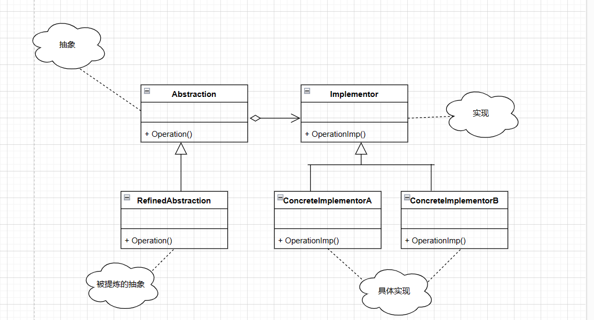

在桥接模式结构图中包含如下几个角色：

**●Abstraction（抽象类**）：用于定义抽象类的接口，它一般是抽象类而不是接口，其中定义了一个Implementor（实现类接口）类型的对象并可以维护该对象，它与Implementor之间具有关联关系，它既可以包含抽象业务方法，也可以包含具体业务方法。

**●RefinedAbstraction（扩充抽象类）**：扩充由Abstraction定义的接口，通常情况下它不再是抽象类而是具体类，它实现了在Abstraction中声明的抽象业务方法，在RefinedAbstraction中可以调用在Implementor中定义的业务方法。

**●Implementor（实现类接口）**：定义实现类的接口，这个接口不一定要与Abstraction的接口完全一致，事实上这两个接口可以完全不同，一般而言，Implementor接口仅提供基本操作，而Abstraction定义的接口可能会做更多更复杂的操作。Implementor接口对这些基本操作进行了声明，而具体实现交给其子类。通过关联关系，在Abstraction中不仅拥有自己的方法，还可以调用到Implementor中定义的方法，使用关联关系来替代继承关系。

**●ConcreteImplementor（具体实现类）**：具体实现Implementor接口，在不同的ConcreteImplementor中提供基本操作的不同实现，在程序运行时，ConcreteImplementor对象将替换其父类对象，提供给抽象类具体的业务操作方法。

优点：

1. 桥接模式，相对于静态的继承而言，极大的减少了子类的个数，从而降低管理和维护成本。
2. 桥接模式提高了系统的可扩展性，在两个变化维度中任意扩展一个维度，都不需要修改原有系统，符合开闭原则。就像一座桥,把两个变化的维度连接了起来。

缺点：

1. 桥接模式的引入会增加系统的理解与设计难度，由于组合/聚合关系建立在抽象层，要求开发者针对抽象进行设计与编程。
2. 桥接模式要求正确的识别出系统中两个独立变化的维度，引起对开发者的编程思想有较高的要求。


### 组合模式（Composite Pattern）

**亦称：** 对象树、Object Tree、Composite

意图：

你可以使用它将对象组合成树状结构，并且能像使用独立对象一样使用他们。

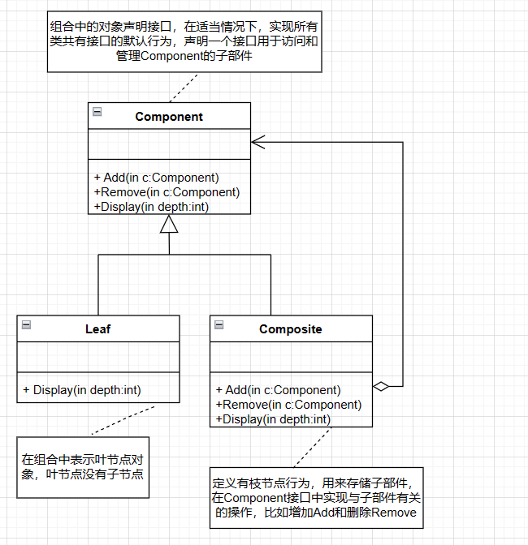

在组合模式结构图中包含如下几个角色：

 （1）Component： 组合模式的根节点，可以是接口、抽象类、普通类，该类定义了子类中所有共性的内容，并且还定义了用于访问和管理子类的方法。

（2）Leaf:组合中的叶子节点，也就是最末端的节点，该节点下，不会再有子节点。

（3）Composite：非叶子节点，它的作用是存储子部件，并且在Composite中实现子对子部件的相关操作。

（4）Client:通过Component接口操作组合部件的对象。

优点:

-  你可以利用多态和递归机制更方便地使用复杂树结构。
-  *开闭原则*。 无需更改现有代码， 你就可以在应用中添加新元素， 使其成为对象树的一部分。

缺点：

-  对于功能差异较大的类， 提供公共接口或许会有困难。 在特定情况下， 你需要过度一般化组件接口， 使其变得令人难以理解。

**组合模式的.NET下应用**

> 总结:你的程序需求如果有部分-整体的结构，并且你希望可以忽略单个对象和组合对象的不同，统一的使用组合结构中的所有的对象。.Net在控件或者界面操作、界面展示等操作，都是使用的组合设计模式。
> 比如说在winform程序开发中，System.Windows.Forms.Control类(Add、Remove)就应用了组合模式。
>
> 比如说在winform程序开发中，System.Windows.Forms.Control类(Add、Remove)就应用了组合模式。

### 享元模式（Flyweight Pattern）

**亦称：** 缓存、Cache、Flyweight

意图：

**共享元对象，运用共享技术有效地支持大量细粒度对象的复用。如果在一个系统中存在多个相同的对象，那么只需要共享一份对象的拷贝，而不必为每一次使用创建新的对象。**

当系统中大量使用某些相同或者相似的对象，这些对象会消耗大量的资源，并且这些对象别除外部状态后可以通过同一个对象来替代。

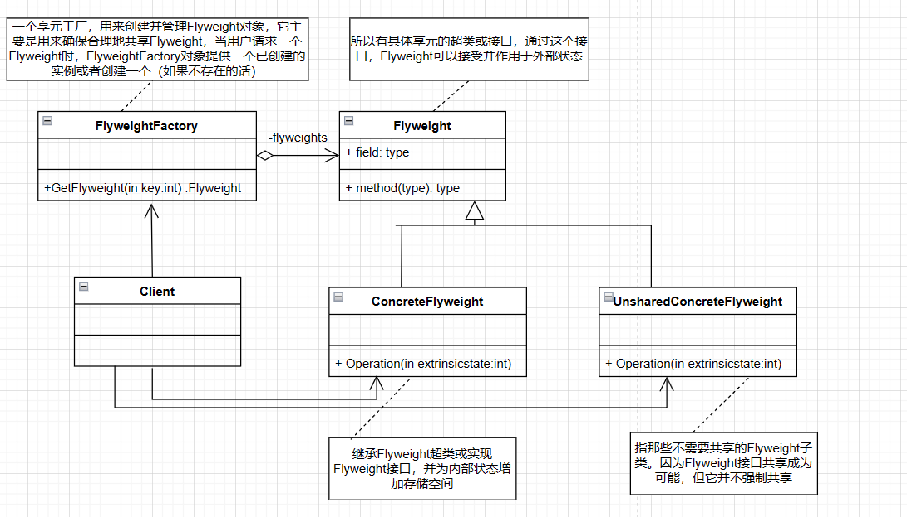

1. **Flyweight**: 享元接口，所有具体享元类的超类或接口，通过该接口Flyweight可以接受并作用于外部状态。通过该接口可以传入外部的状态，在享元对象的方法处理中可能会使用这些外部的数据。
2. **ConcreteFlyweight**: 具体的享元实现对象，指定内部状态，必须是共享的，需要封装Flyweight的内部状态。
3. **UnshareConcreteFlyweight**: 非共享的享元实现对象，并不是所有的Flyweight实现对象都需要共享。非共享的享元实现对象通常是对享元对象的组合对象。
4. **FlyweightFactoty**: 享元工厂类，主要用来创建并管理共享的享元对象，并对外提供访问共享享元的接口。当用户请求一个Flyweight时，FlyweightFactory就会提供一个已经创建的Flyweight对象或者新建一个（如果不存在）。
5. **Client**: 享元客户端，主要的工作就是维持一个对Flyweight的引用，计算或存储享元的外部状态，当然这里可访问共享和不共享的Flyweight对象。    

**何时使用：** 

 1、系统中有大量对象。

 2、这些对象消耗大量内存。

 3、这些对象的状态大部分可以外部化。

 4、这些对象可以按照内蕴状态分为很多组，当把外蕴对象从对象中剔除出来时，每一组对象都可以用一个对象来代替。

 5、系统不依赖于这些对象身份，这些对象是不可分辨的。

 6、字符串拘留池、数据库连接池、线程池等

首先了解两个概念：

内部状态：对象内部不受环境改变的部分作为内部状态。 

外部状态：随着环境的变化而变化的部分。   

享元模式和单例模式的区别

1.单例模式只有一个对象，享元模式支持多个相同的对象

2.享元模式有一个内部状态和外部状态，单例模式没有这个概念

3.享元模式有池的概念，单例模式没有池的概念

优点:

​        通过对象的复用，减少了对象的数量，节省内存。

缺点:

​        需要分类对象内部和外部的状态，提高了系统的复杂度。


## **行为型模式**

 作用于类或者对象之间互相协作完成单个对象无法单独完成的任务,以及怎样分配职责。

### 中介者模式（Mediator Pattern）

意图：

​    中介者模式是一种行为型设计模式，能让你减少对象之间混乱无充的依赖关系。该模式会限制对象之间的直接交互，迫使他们通过一个中介者对象进行全作。

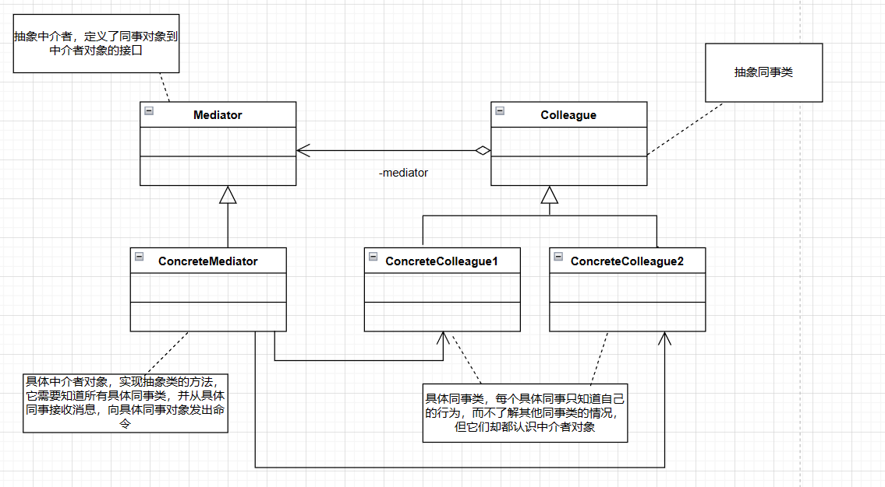

 在中介者模式结构图中包含如下几个角色：

-  **Mediator：中介者接口**。在里面定义各个同事之间交互需要的方法，可以是公共的通讯方法，比如changed方法，大家都用，也可以是小范围的交互方法。
- **ConcreteMediator：中介者具体实现对象**。它需要了解并维护各个同事对象，并负责具体的协调各同事对象的交互关系。
- **Colleague：参与者类的定义，通常实现成为抽象类**，主要负责约束同事对象的类型，并实现一些具体同事类之间的公共功能，比如：每个具体同事类都应该知道中介者对象，也就是具体同事类都会持有中介者对象，就可以定义到这个类里面。
- **ConcreteColleague：参与者具体类**，实现自己的业务，在需要与其它同事通讯的时候，就与持有的中介者通信，中介者会负责与其它的同事交互。

优点：

- 简化了对象之间的交互，它用中介者和同事的一对多交互代替了原来同事之间的多对多交互，将原本难以理解的网状结构转换成相对简单的星型结构。
- 可将各同事对象解耦。
-  可以减少子类生成，中介者模式将原本分布于多个对象间的行为集中在一起，改变这些行为只需生成新的中介者子类即可，这使得各个同事类可被重用，无须直接对同事类进行扩展。
-  你可以更方便地复用各个组件。

缺点：

- 中介者模式的缺点是显而易见的，因为这个“中介“承担了较多的责任，所以一旦这个中介对象出现了问题，那么整个系统就会受到重大的影响。
- 在具体中介者类中包含了大量的同事之间的交互细节，可能会导致具体中介者类非常复杂，使得系统难以维护。

   中介者模式与发布/订阅模式的异同

1. 中介者模式与业务相关，订阅/发布模式与业务无关。

2. 两个模式都有集中调度效果，对象之间不直接参与通信。


